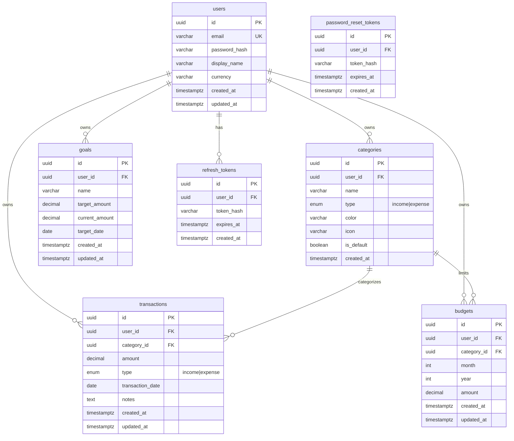

# Database Schema

**Database:** PostgreSQL 15+  
**ORM recommendation:** Prisma or Knex + raw SQL migrations

---

## Entity Relationship Diagram



---

## Table Definitions

### `users`

| Column | Type | Constraints | Notes |
|--------|------|-------------|-------|
| `id` | `UUID` | PK, default `gen_random_uuid()` | |
| `email` | `VARCHAR(255)` | UNIQUE, NOT NULL | Lowercased on insert |
| `password_hash` | `VARCHAR(255)` | NOT NULL | bcrypt |
| `display_name` | `VARCHAR(100)` | NOT NULL | |
| `currency` | `VARCHAR(3)` | NOT NULL, default `'USD'` | Stretch: multi-currency |
| `created_at` | `TIMESTAMPTZ` | NOT NULL, default `NOW()` | |
| `updated_at` | `TIMESTAMPTZ` | NOT NULL, default `NOW()` | |

**Indexes:** `UNIQUE (email)`

---

### `categories`

| Column | Type | Constraints | Notes |
|--------|------|-------------|-------|
| `id` | `UUID` | PK | |
| `user_id` | `UUID` | FK → `users.id` ON DELETE CASCADE | |
| `name` | `VARCHAR(50)` | NOT NULL | |
| `type` | `category_type` ENUM | NOT NULL | `'income'`, `'expense'` |
| `color` | `VARCHAR(7)` | NOT NULL | Hex e.g. `#3B82F6` |
| `icon` | `VARCHAR(50)` | NULL | Emoji or icon name |
| `is_default` | `BOOLEAN` | NOT NULL, default `false` | |
| `created_at` | `TIMESTAMPTZ` | NOT NULL, default `NOW()` | |

**Indexes:**
- `UNIQUE (user_id, name, type)`
- `INDEX idx_categories_user_id ON (user_id)`

---

### `transactions`

| Column | Type | Constraints | Notes |
|--------|------|-------------|-------|
| `id` | `UUID` | PK | |
| `user_id` | `UUID` | FK → `users.id` ON DELETE CASCADE | |
| `category_id` | `UUID` | FK → `categories.id` ON DELETE RESTRICT | Prevent orphan deletes |
| `amount` | `DECIMAL(12,2)` | NOT NULL, CHECK `amount > 0` | Always positive |
| `type` | `transaction_type` ENUM | NOT NULL | `'income'`, `'expense'` |
| `transaction_date` | `DATE` | NOT NULL | User-facing date |
| `notes` | `TEXT` | NULL | |
| `created_at` | `TIMESTAMPTZ` | NOT NULL, default `NOW()` | |
| `updated_at` | `TIMESTAMPTZ` | NOT NULL, default `NOW()` | |

**Indexes:**
- `INDEX idx_transactions_user_date ON (user_id, transaction_date DESC)`
- `INDEX idx_transactions_user_category ON (user_id, category_id)`
- `INDEX idx_transactions_notes_trgm ON (notes gin_trgm_ops)` — optional, for search

---

### `budgets`

| Column | Type | Constraints | Notes |
|--------|------|-------------|-------|
| `id` | `UUID` | PK | |
| `user_id` | `UUID` | FK → `users.id` ON DELETE CASCADE | |
| `category_id` | `UUID` | FK → `categories.id` ON DELETE CASCADE | Expense categories only |
| `month` | `SMALLINT` | NOT NULL, CHECK 1–12 | |
| `year` | `SMALLINT` | NOT NULL, CHECK ≥ 2020 | |
| `amount` | `DECIMAL(12,2)` | NOT NULL, CHECK `amount > 0` | Monthly limit |
| `created_at` | `TIMESTAMPTZ` | NOT NULL, default `NOW()` | |
| `updated_at` | `TIMESTAMPTZ` | NOT NULL, default `NOW()` | |

**Indexes:**
- `UNIQUE (user_id, category_id, month, year)`
- `INDEX idx_budgets_user_period ON (user_id, year, month)`

---

### `goals` (stretch)

| Column | Type | Constraints | Notes |
|--------|------|-------------|-------|
| `id` | `UUID` | PK | |
| `user_id` | `UUID` | FK → `users.id` ON DELETE CASCADE | |
| `name` | `VARCHAR(100)` | NOT NULL | e.g. "Emergency fund" |
| `target_amount` | `DECIMAL(12,2)` | NOT NULL | |
| `current_amount` | `DECIMAL(12,2)` | NOT NULL, default `0` | |
| `target_date` | `DATE` | NULL | Optional deadline |
| `created_at` | `TIMESTAMPTZ` | NOT NULL | |
| `updated_at` | `TIMESTAMPTZ` | NOT NULL | |

---

### `refresh_tokens`

| Column | Type | Constraints | Notes |
|--------|------|-------------|-------|
| `id` | `UUID` | PK | |
| `user_id` | `UUID` | FK → `users.id` ON DELETE CASCADE | |
| `token_hash` | `VARCHAR(255)` | NOT NULL | SHA-256 of token |
| `expires_at` | `TIMESTAMPTZ` | NOT NULL | |
| `created_at` | `TIMESTAMPTZ` | NOT NULL | |

**Indexes:** `INDEX idx_refresh_tokens_user ON (user_id)`

---

### `password_reset_tokens` (optional)

| Column | Type | Constraints |
|--------|------|-------------|
| `id` | `UUID` | PK |
| `user_id` | `UUID` | FK → `users.id` ON DELETE CASCADE |
| `token_hash` | `VARCHAR(255)` | NOT NULL |
| `expires_at` | `TIMESTAMPTZ` | NOT NULL |
| `created_at` | `TIMESTAMPTZ` | NOT NULL |

---

## Seed Data: Default Categories

Inserted in a transaction when a user registers:

**Expense:** Food & Dining, Transportation, Housing, Utilities, Entertainment, Shopping, Healthcare, Other  
**Income:** Salary, Freelance, Investments, Other Income

---

## Key Queries (for API design)

### Dashboard summary (current month)
```sql
SELECT
  COALESCE(SUM(CASE WHEN type = 'income' THEN amount END), 0) AS total_income,
  COALESCE(SUM(CASE WHEN type = 'expense' THEN amount END), 0) AS total_expenses
FROM transactions
WHERE user_id = $1
  AND transaction_date >= date_trunc('month', CURRENT_DATE)
  AND transaction_date < date_trunc('month', CURRENT_DATE) + INTERVAL '1 month';
```

### Budget progress
```sql
SELECT b.*, c.name, c.color,
  COALESCE(SUM(t.amount), 0) AS spent
FROM budgets b
JOIN categories c ON c.id = b.category_id
LEFT JOIN transactions t ON t.category_id = b.category_id
  AND t.user_id = b.user_id
  AND t.type = 'expense'
  AND EXTRACT(MONTH FROM t.transaction_date) = b.month
  AND EXTRACT(YEAR FROM t.transaction_date) = b.year
WHERE b.user_id = $1 AND b.month = $2 AND b.year = $3
GROUP BY b.id, c.id;
```

### Category breakdown (reports)
```sql
SELECT c.name, c.color, SUM(t.amount) AS total
FROM transactions t
JOIN categories c ON c.id = t.category_id
WHERE t.user_id = $1 AND t.type = 'expense'
  AND t.transaction_date BETWEEN $2 AND $3
GROUP BY c.id
ORDER BY total DESC;
```

---

## Migration Strategy

1. `001_create_enums.sql` — `category_type`, `transaction_type`
2. `002_create_users.sql`
3. `003_create_categories.sql`
4. `004_create_transactions.sql`
5. `005_create_budgets.sql`
6. `006_create_auth_tokens.sql`
7. `007_create_goals.sql` (stretch)

Use a migration tool; never edit applied migrations in production.
