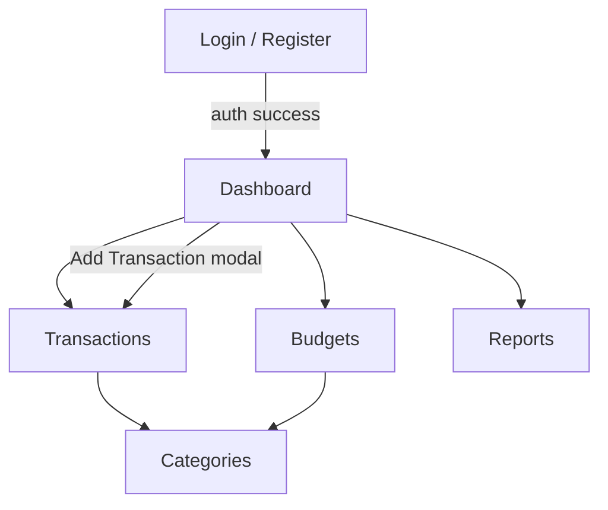

# UI Wireframes

ASCII wireframes for MVP screens. Design system: clean, card-based layout, primary color for CTAs, green for income, red for expenses.

**Breakpoints:** Mobile (< 768px) uses bottom nav; Desktop uses left sidebar.

---

## Global Layout (Authenticated)

### Desktop (≥ 1024px)

```
┌──────────────────────────────────────────────────────────────────────────┐
│  💰 FinanceApp          [Month: June 2026 ▼]     🔔   Alex ▼  [Logout]  │
├────────────┬─────────────────────────────────────────────────────────────┤
│            │                                                             │
│  Dashboard │                    MAIN CONTENT AREA                          │
│  ─────────│                                                             │
│  Transact. │                                                             │
│  Budgets   │                                                             │
│  Reports   │                                                             │
│  Categories│                                                             │
│            │                                                             │
│  ─────────│                                                             │
│  Settings  │                                                             │
│            │                                                             │
└────────────┴─────────────────────────────────────────────────────────────┘
```

### Mobile (< 768px)

```
┌─────────────────────────────┐
│ FinanceApp        Alex ▼    │
├─────────────────────────────┤
│                             │
│      MAIN CONTENT           │
│                             │
│                             │
├─────────────────────────────┤
│ 🏠  💳  📊  📁  ⚙️          │
│ Dash Txn Rpt Cat  More      │
└─────────────────────────────┘
```

---

## Screen 1: Login / Register

### Login

```
┌─────────────────────────────────────┐
│                                     │
│         💰 Personal Finance         │
│                                     │
│    ┌─────────────────────────┐      │
│    │  Email                  │      │
│    └─────────────────────────┘      │
│    ┌─────────────────────────┐      │
│    │  Password           👁   │      │
│    └─────────────────────────┘      │
│                                     │
│         [    Log in    ]              │
│                                     │
│    Forgot password?                 │
│    Don't have an account? Register  │
│                                     │
└─────────────────────────────────────┘
```

### Register

Same layout with fields: Display Name, Email, Password, Confirm Password.

---

## Screen 2: Dashboard

```
┌──────────────────────────────────────────────────────────────────────────┐
│  Dashboard                                          June 2026            │
├──────────────────────────────────────────────────────────────────────────┤
│                                                                          │
│  ┌──────────────┐  ┌──────────────┐  ┌──────────────┐  ┌──────────────┐ │
│  │ Balance      │  │ Income       │  │ Expenses     │  │ Net Savings  │ │
│  │ $12,450.00   │  │ $5,200.00    │  │ $3,180.50    │  │ $2,019.50    │ │
│  │ ▲ all time   │  │ this month   │  │ this month   │  │ this month   │ │
│  └──────────────┘  └──────────────┘  └──────────────┘  └──────────────┘ │
│                                                                          │
│  ┌─────────────────────────────┐  ┌─────────────────────────────────────┐│
│  │ Spending Trend (6 mo)       │  │ Budget Alerts                       ││
│  │                             │  │                                     ││
│  │    ▄▄                       │  │  Food      ████████░░  87%  ⚠       ││
│  │   ▄██▄▄    ▄▄               │  │  Shopping  ██████████ 105% 🔴      ││
│  │  ▄██████▄▄██▄               │  │  Transport █████░░░░░  52%          ││
│  │ Jan Feb Mar Apr May Jun       │  │                                     ││
│  └─────────────────────────────┘  └─────────────────────────────────────┘│
│                                                                          │
│  Recent Transactions                              [+ Add Transaction]    │
│  ┌────────────────────────────────────────────────────────────────────┐│
│  │ 🍔 Food & Dining      Grocery run              -$45.99    Jun 24   ││
│  │ 💼 Salary             Paycheck                  +$2,600    Jun 15   ││
│  │ 🚗 Transportation     Gas                      -$52.00    Jun 12   ││
│  │ 🎬 Entertainment      Netflix                  -$15.99    Jun 10   ││
│  └────────────────────────────────────────────────────────────────────┘│
│                                              View all transactions →     │
└──────────────────────────────────────────────────────────────────────────┘
```

**Key interactions:**
- Summary cards are not clickable (informational)
- Budget alert rows → Budgets page filtered to category
- "+ Add Transaction" → modal
- Month selector in header updates all dashboard data

---

## Screen 3: Transactions

```
┌──────────────────────────────────────────────────────────────────────────┐
│  Transactions                                    [+ Add Transaction]     │
├──────────────────────────────────────────────────────────────────────────┤
│  ┌──────── Search notes or amount... ────────┐  [Filters ▼]              │
│                                                                          │
│  Filters (expanded):                                                     │
│  Type: [All ▼]  Category: [All ▼]  From: [____]  To: [____]  [Apply]    │
│                                                                          │
│  ┌────────────────────────────────────────────────────────────────────┐ │
│  │ Date       Category          Notes              Amount      ⋮      │ │
│  ├────────────────────────────────────────────────────────────────────┤ │
│  │ Jun 24     Food & Dining     Grocery run        -$45.99    Edit Del│ │
│  │ Jun 15     Salary            Paycheck           +$2,600    Edit Del│ │
│  │ Jun 12     Transportation    Gas                -$52.00    Edit Del│ │
│  │ ...                                                                │ │
│  └────────────────────────────────────────────────────────────────────┘ │
│                                                                          │
│                    ← Prev    Page 1 of 8    Next →                       │
└──────────────────────────────────────────────────────────────────────────┘
```

### Add/Edit Transaction Modal

```
        ┌─────────────────────────────────┐
        │  Add Transaction            ✕   │
        ├─────────────────────────────────┤
        │  Type:  (•) Expense  ( ) Income │
        │                                 │
        │  Amount:  [ $________ ]         │
        │  Category:[ Food & Dining ▼ ]   │
        │  Date:    [ 2026-06-24    📅 ]   │
        │  Notes:   [________________]    │
        │                                 │
        │     [Cancel]    [Save]          │
        └─────────────────────────────────┘
```

---

## Screen 4: Budgets

```
┌──────────────────────────────────────────────────────────────────────────┐
│  Budgets — June 2026              [← May]  [June]  [July →]  [Copy prev]│
├──────────────────────────────────────────────────────────────────────────┤
│                                                                          │
│  Total budgeted: $2,400    Spent: $2,105    Remaining: $295              │
│                                                                          │
│  ┌────────────────────────────────────────────────────────────────────┐ │
│  │ Category        Budget    Spent     Progress              Edit     │ │
│  ├────────────────────────────────────────────────────────────────────┤ │
│  │ 🍔 Food         $500     $435     ████████░░ 87%         ✏️       │ │
│  │ 🛍 Shopping     $300     $315     ██████████ 105% 🔴      ✏️       │ │
│  │ 🚗 Transport    $200     $104     █████░░░░░ 52%         ✏️       │ │
│  │ 🏠 Housing      $1,200   $1,200   ██████████ 100% ⚠      ✏️       │ │
│  └────────────────────────────────────────────────────────────────────┘ │
│                                                                          │
│  [+ Add Budget]                                                          │
└──────────────────────────────────────────────────────────────────────────┘
```

**Status colors:**
- Green/blue: < 80%
- Yellow/amber: 80–99%
- Red: ≥ 100%

---

## Screen 5: Reports

```
┌──────────────────────────────────────────────────────────────────────────┐
│  Reports                                                                 │
├──────────────────────────────────────────────────────────────────────────┤
│  Range: [Last 6 months ▼]  or  From [____] To [____]    [Export CSV]      │
│                                                                          │
│  ┌────────────────────────────────────────────────────────────────────┐ │
│  │ Income vs Expenses                                                 │ │
│  │                                                                    │ │
│  │  $6k ┤     ██                                                      │ │
│  │  $4k ┤ ██  ██  ██  ██  ██  ██                                     │ │
│  │  $2k ┤ ██  ██  ██  ██  ██  ██                                     │ │
│  │      └─────────────────────────                                   │ │
│  │        Jan Feb Mar Apr May Jun                                    │ │
│  │        ■ Income  ■ Expenses                                       │ │
│  └────────────────────────────────────────────────────────────────────┘ │
│                                                                          │
│  ┌──────────────────────────┐  ┌──────────────────────────────────────┐│
│  │ Spending by Category     │  │ Top Categories                       ││
│  │                          │  │                                      ││
│  │      [PIE CHART]         │  │  1. Housing     $1,200   38%        ││
│  │                          │  │  2. Food        $435     14%        ││
│  │                          │  │  3. Shopping    $315     10%        ││
│  └──────────────────────────┘  └──────────────────────────────────────┘│
└──────────────────────────────────────────────────────────────────────────┘
```

---

## Screen 6: Categories

```
┌──────────────────────────────────────────────────────────────────────────┐
│  Categories                                          [+ Add Category]    │
├──────────────────────────────────────────────────────────────────────────┤
│  Expense Categories                                                      │
│  ┌────────────────────────────────────────────────────────────────────┐ │
│  │ ● Food & Dining    default                              (locked)    │ │
│  │ ● Coffee           custom                               Edit  Del   │ │
│  │ ● Transportation   default                              (locked)    │ │
│  └────────────────────────────────────────────────────────────────────┘ │
│                                                                          │
│  Income Categories                                                       │
│  ┌────────────────────────────────────────────────────────────────────┐ │
│  │ ● Salary           default                              (locked)    │ │
│  │ ● Freelance        default                              (locked)    │ │
│  └────────────────────────────────────────────────────────────────────┘ │
└──────────────────────────────────────────────────────────────────────────┘
```

---

## Navigation Map



---

## Design Tokens (Tailwind)

| Token | Value | Usage |
|-------|-------|-------|
| Primary | `blue-600` | Buttons, links |
| Income | `emerald-600` | Positive amounts |
| Expense | `rose-600` | Negative amounts |
| Warning | `amber-500` | Budget 80%+ |
| Danger | `red-600` | Budget 100%+ |
| Surface | `slate-50` / `white` | Cards |
| Text | `slate-900` / `slate-500` | Headings / muted |

**Typography:** Inter or system sans-serif; tabular nums for currency (`font-variant-numeric: tabular-nums`).

---

## Empty States

| Screen | Message | CTA |
|--------|---------|-----|
| Dashboard (no txns) | "No transactions yet" | Add your first transaction |
| Transactions | "No transactions match your filters" | Clear filters |
| Budgets | "No budgets set for this month" | Create a budget |
| Reports | "Not enough data to chart" | Add transactions |
