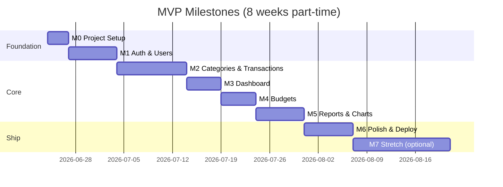

# Milestones

Phased delivery from zero to portfolio-ready deployment. Each milestone ends with a **demoable** increment.

---

## Overview

---

## M0: Project Setup (Days 1–3)

**Goal:** Runnable skeleton with DB connected.

**Deliverables:**
- [ ] Git repo initialized with `.gitignore`
- [ ] `client/` — Vite + React + Tailwind scaffold
- [ ] `server/` — Express with health endpoint
- [ ] `database/` — Docker Compose PostgreSQL + first migration (`users`)
- [ ] ESLint + Prettier on both packages
- [ ] README with local setup instructions
- [ ] Environment variable templates

**Definition of done:** `npm run dev` on client and server; `GET /api/health` returns 200; DB migrations run cleanly.

---

## M1: Authentication (Week 1)

**Goal:** Users can register, login, logout; protected routes work.

**Deliverables:**
- [ ] `users` + `refresh_tokens` tables
- [ ] Register, login, logout, refresh endpoints
- [ ] Password hashing (bcrypt)
- [ ] JWT middleware
- [ ] Seed default categories on register
- [ ] Login & Register pages
- [ ] AuthContext + ProtectedRoute
- [ ] Token refresh interceptor (client)

**Definition of done:** New user registers → lands on empty dashboard; logout clears session; API returns 401 without token.

**Demo:** Record register → login → logout flow.

---

## M2: Categories & Transactions (Weeks 2–3)

**Goal:** Full CRUD for transactions and categories.

**Deliverables:**
- [ ] `categories` + `transactions` tables + migrations
- [ ] Category CRUD API
- [ ] Transaction CRUD API with pagination, filters, search
- [ ] Categories page (list, add, edit, delete)
- [ ] Transactions page (list, filters, add/edit modal, delete)
- [ ] Reusable UI components (Button, Input, Modal, Card)

**Definition of done:** User can add 10+ transactions across categories; search and date filter work; edit/delete persist correctly.

**Demo:** Add expenses and income; filter by category.

---

## M3: Dashboard (Week 4)

**Goal:** At-a-glance financial overview.

**Deliverables:**
- [ ] `GET /reports/summary` endpoint
- [ ] Recent transactions query (limit 10)
- [ ] Summary cards (balance, income, expenses, net)
- [ ] Recent transactions widget
- [ ] Month selector in header
- [ ] Loading skeletons + empty states

**Definition of done:** Dashboard reflects real transaction data; changing month updates totals.

**Demo:** Dashboard after adding a month of sample data.

---

## M4: Budgets (Week 5)

**Goal:** Monthly budget tracking with visual progress.

**Deliverables:**
- [ ] `budgets` table + migration
- [ ] Budget CRUD API with spent calculation
- [ ] Budget status logic (ok / warning / over)
- [ ] Budgets page with progress bars
- [ ] Budget alerts widget on dashboard
- [ ] Copy previous month budgets (optional)

**Definition of done:** Setting a $500 food budget shows correct % as transactions are added; over-budget turns red.

**Demo:** Set budgets → add transactions → see alerts.

---

## M5: Reports & Charts (Week 6)

**Goal:** Visual analytics for portfolio impact.

**Deliverables:**
- [ ] `GET /reports/trends` and `GET /reports/categories`
- [ ] Reports page with Recharts (bar + pie)
- [ ] Date range selector
- [ ] Mini trend chart on dashboard (optional)
- [ ] Responsive charts on mobile

**Definition of done:** Charts match transaction data for selected range; legends and tooltips work.

**Demo:** 6-month trend + category pie chart walkthrough.

---

## M6: Polish & Deploy (Week 7–8)

**Goal:** Production-ready portfolio piece.

**Deliverables:**
- [ ] Error handling (toast notifications)
- [ ] Form validation (client + server)
- [ ] Mobile responsive pass on all pages
- [ ] Rate limiting on auth routes
- [ ] Deploy backend to Render/Railway
- [ ] Deploy frontend to Vercel
- [ ] Production env vars configured
- [ ] README: screenshots, live links, tech stack, architecture
- [ ] Seed script or demo account for recruiters
- [ ] (Optional) Forgot password flow
- [ ] (Optional) CSV export

**Definition of done:** Public URLs work; README has live demo link; no console errors on happy path.

**Demo:** Share live URL + 3-minute Loom video.

---

## M7: Stretch Features (Post-MVP)

Pick 1–2 to deepen the portfolio:

| Feature | Effort | Recruiter appeal |
|---------|--------|------------------|
| Dark mode | Low | UI polish |
| CSV import/export | Medium | Data handling |
| Savings goals | Medium | Extra CRUD + UX |
| Recurring transactions | High | Scheduling logic |
| AI spending insights | High | Modern / LLM integration |

---

## Risk Register

| Risk | Mitigation |
|------|------------|
| Scope creep | Stick to Must stories until M6 ships |
| Auth bugs | Use battle-tested patterns; test refresh flow early |
| Chart performance | Aggregate on server; limit date ranges |
| Deployment CORS issues | Set `CLIENT_URL` early; test staging deploy in M5 |
| Time overrun | Cut forgot-password and CSV export first |

---

## Portfolio Checklist (Recruiter-Facing)

- [ ] Live demo URL
- [ ] GitHub with meaningful commits (not one giant commit)
- [ ] README with architecture diagram
- [ ] Clean dashboard screenshot
- [ ] Auth demonstrated
- [ ] Charts demonstrated
- [ ] Mobile screenshot
- [ ] LinkedIn / resume bullet with metrics ("Built full-stack app with X endpoints, Y tables")
